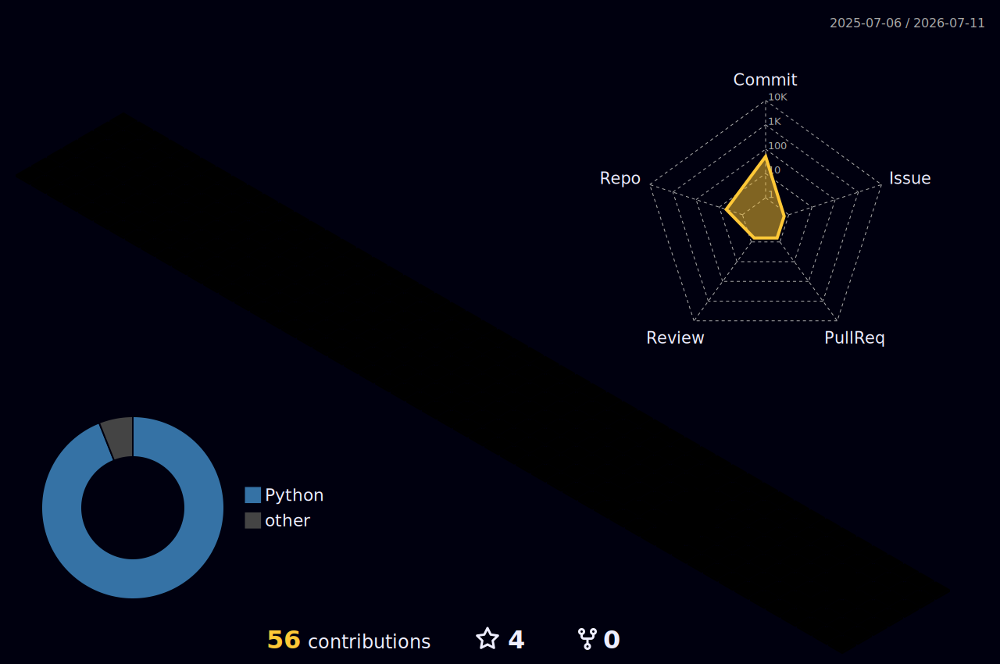

<!-- Animated Gradient Header -->


<div align="center">

<br/>


<br/>

<a href="https://www.linkedin.com/in/shashank-patil-316ab9348"></a>&nbsp;
<a href="mailto:shashankrpatil077@gmail.com"></a>&nbsp;
<a href="https://github.com/shashankrpatil077-ctrl"></a>&nbsp;


</div>

<br/>

## ▸ About

```yaml
name: Shashank R. Patil
role: AI Agent Architect & Web3 Engineer
location: India
focus:
  - Autonomous AI agents with multi-provider LLM orchestration
  - On-chain agent identity (ERC-8004) and trustless execution
  - Machine-to-machine payment infrastructure (HTTP 402 / Circle USDC)
currently_building: XOYO Omega — a 27-service autonomous AI operating system
open_to: Full-time roles in AI/ML Engineering, Web3 Infra, or Agent Systems
```

<br/>

## ▸ Tech Stack

<div align="center">

**Languages & Frameworks**
<br/>
<a href="https://skillicons.dev">
  
</a>

<br/><br/>

**Infrastructure & Tooling**
<br/>
<a href="https://skillicons.dev">
  
</a>

</div>

<br/>

## ▸ Featured Work

<table>
  <tr>
    <td width="50%">
      <h3 align="center"><a href="https://github.com/shashankrpatil077-ctrl/xoyo">XOYO Omega</a></h3>
      <p align="center"><strong>Autonomous AI Operating System</strong></p>
      <p align="center">27 core microservices (expandable to 45+ with GPU) — multi-provider LLM routing across 8 providers, hierarchical memory, constitutional safety guardrails, and self-healing watchdog daemon.</p>
      <p align="center">
        
        
        
      </p>
    </td>
    <td width="50%">
      <h3 align="center"><a href="https://github.com/shashankrpatil077-ctrl/Street_07">Street_07</a></h3>
      <p align="center"><strong>Autonomous BTC Trading Agent</strong></p>
      <p align="center">13-indicator confluence strategy with Kraken CLI execution and ERC-8004 on-chain trade logging on Base Sepolia. Built for the Surge × Kraken Hackathon.</p>
      <p align="center">
        
        
        
      </p>
    </td>
  </tr>
  <tr>
    <td width="50%">
      <h3 align="center"><a href="https://github.com/shashankrpatil077-ctrl/NeuralMarket">NeuralMarket</a></h3>
      <p align="center"><strong>HTTP 402 Payment Protocol Client</strong></p>
      <p align="center">Automatically detects payment-required API responses and executes Circle USDC transfers — enabling seamless machine-to-machine micro-transactions.</p>
      <p align="center">
        
        
        
      </p>
    </td>
    <td width="50%">
      <h3 align="center">More Coming Soon</h3>
      <p align="center"><strong>Always building, always shipping.</strong></p>
      <p align="center">Agent-to-agent communication protocols, DeFi strategy backtesting, and autonomous research systems — all in active development.</p>
      <p align="center">
        
      </p>
    </td>
  </tr>
</table>

<br/>

## ▸ Trophies

<div align="center">
  
</div>

<br/>

## ▸ GitHub Activity

<div align="center">


</div>

<br/>

<div align="center">
  
</div>

<br/>

<div align="center">


</div>

<br/>

## ▸ Contribution Snake

<picture>
  <source media="(prefers-color-scheme: dark)" srcset="https://raw.githubusercontent.com/shashankrpatil077-ctrl/shashankrpatil077-ctrl/output/github-snake-dark.svg">
  <source media="(prefers-color-scheme: light)" srcset="https://raw.githubusercontent.com/shashankrpatil077-ctrl/shashankrpatil077-ctrl/output/github-snake.svg">
  
</picture>

<br/>

## ▸ 3D Contribution Calendar

<div align="center">

<picture>
  <source media="(prefers-color-scheme: dark)" srcset="./profile-3d-contrib/profile-night-rainbow.svg">
  <source media="(prefers-color-scheme: light)" srcset="./profile-3d-contrib/profile-season-animate.svg">
  
</picture>

</div>

<br/>

<!-- Animated Gradient Footer -->


